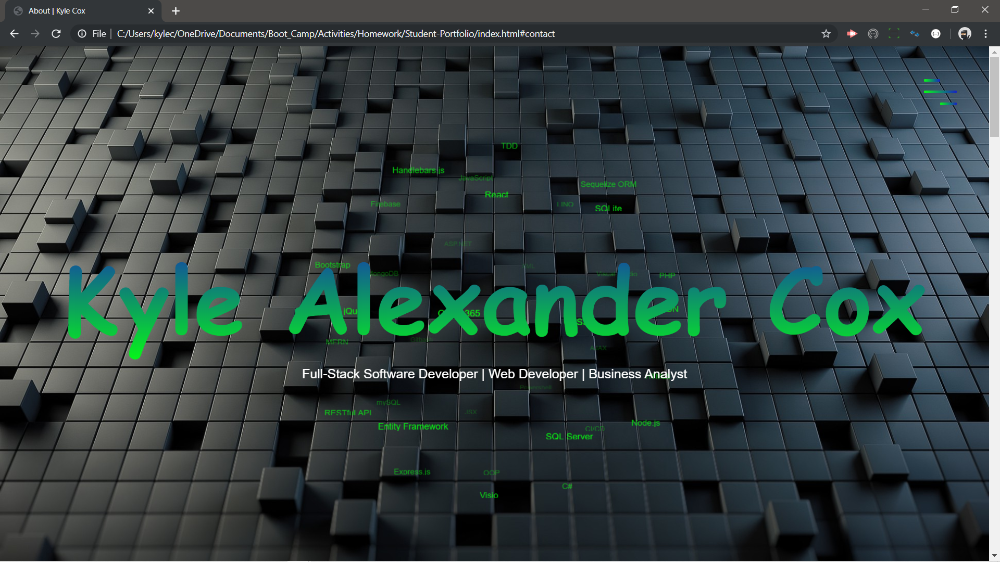
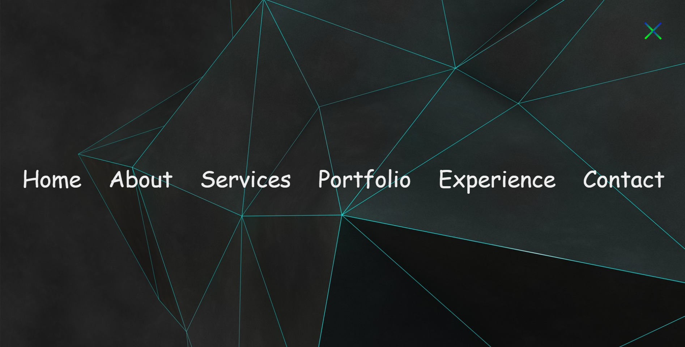

# Professional Portfolio
This portfolio page is built with custom CSS stylings and executes various animations via tagcanvas. The bottom of the page features a form for users to send emails directly to the linked address. 

## Overview

The portfolio page is divided into five sections:

    * About Me
    * Services
    * Portfolio
    * Experience
    * Contact
    
## Navbar

There is a nav bar icon located at the top-right corner of the page. Upon clicking the icon, a nav bar drops down with a the titles of each section of the portfolio. When a section title is clicked, the user is guided to the corresponding section of the student portfolio page via auto-scroll navigation. The user also has the option to click the nav bar icon to exit the nav bar screen.  
    

    
### About Me

    * Provides a brief description of my current status as a developer and relevant work history
    * Displays a recent photograph
    * Shares links to my FaceBook, GitHub account, LinkedIn, and most updated resume
 
### Services

    * Provides a concise description of the services that I provide within my capacity as a software developer, web developer and data           analyst
    
### Portfolio

### Experience

### Contact

